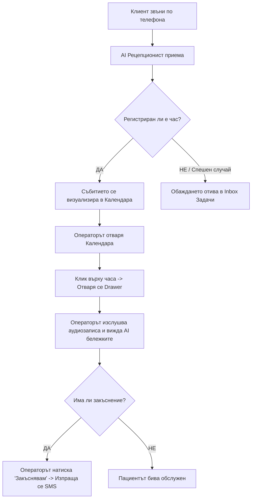

# Дизайн Спецификация: CRM Табло за Управление на AI Рецепционист

**Дата:** 29 юни 2026 г.  
**Версия:** 1.0  
**Автор:** Antigravity AI  
**Цел:** Детайлно описание на менютата, разделите, разположението на бутоните и потребителското изживяване (UX/UI) в приложението за максимално лесно и професионално управление на повикванията и календара.

---

## 1. Архитектура и Навигационна Рамка (Layout)

Системата използва **двузонова навигационна рамка**:
1. **Ляво навигационно меню (Sidebar)**: Постоянен страничен панел за навигация с тъмен, минималистичен стил.
2. **Горна работна лента (Header Bar)**: Светла, полупрозрачна лента (Glassmorphism), която показва контекста (активна фирма, статус на AI асистента на живо и бързи контроли).

### Ляво меню (Sidebar) - Списък с бутони и разположение:
* **Най-отгоре**: Лого на фирмата + падащо меню за избор на организация/клон (за управление на няколко обекта).
* **Поле за Търсене (Search Bar)**: Интегрирана търсачка с бърз клавиш `Cmd + K` или `Ctrl + K`. Позволява незабавно намиране на клиент по име/телефон или търсене на конкретен час.
* **Раздели (Navigation Tabs)**:
  * **Табло (Dashboard)** - Икона `LayoutDashboard`
  * **Календар (Calendar)** - Икона `Calendar`
  * **Задачи (Inbox)** - Икона `Inbox` (с червен бадж за брой спешни повиквания)
  * **Обаждания (Call Log)** - Икона `PhoneCall`
  * **Клиенти (CRM)** - Икона `Users`
  * **AI Настройки (Settings)** - Икона `Sliders`

---

## 2. Разположение на Бутоните и Функционалността по Екрани

### А. Горна лента (Header Bar) - Общи бързи контроли:
* **Индикатор "На живо" (Live Call Widget)**: Когато AI разговаря с клиент в реално време, се появява пулсиращ зелен индикатор: `● AI разговаря на живо...`.
  * **Бутон "Поеми разговора" (Takeover Call)**: Разположен непосредствено до индикатора на живо. При натискане пренасочва разговора от AI към SIP/мобилния телефон на оператора в реално време, за да се намеси човек.
* **Потребителски профил**: Снимка/Аватар с настройки на акаунта и изход.

---

### Б. Таб "Календар" (Основен екран)
Календарът визуализира дневния, седмичния или месечния график с оцветени според услугата блокове.

#### Бутони в Календарната лента (Toolbar):
1. **Бутон "Закъснявам" (Late Delay Indicator)**: 
   * *Разположение*: Горе вдясно, до избора на изглед (Ден/Седмица).
   * *Действие*: Отваря малък прозорец (Popover) с опции: `+15 мин`, `+30 мин`, `+45 мин`. При натискане, системата преизчислява графика на оставащите за деня часове и изпраща автоматичен SMS към следващите клиенти: *"Уважаеми клиенти, поради извънредно закъснение, вашият час днес ще бъде забавен с около [X] минути. Извиняваме се за неудобството."*
2. **Бутон "Блокирай време" (Block Time)**:
   * *Разположение*: Горе вляво, до стрелките за смяна на дните.
   * *Действие*: Позволява на лекаря/управителя да избере период (напр. 13:00 - 14:00) и да го маркира като "Почивка" или "Среща". AI автоматично спира да предлага този слот.

#### Бутони вътре в Страничния Слайдер (Appointment Drawer - отваря се при клик на час):
* **Най-отгоре (Заглавие)**: Име на клиента и статус икона (Заявен / Потвърден / Анулиран).
* **Секция Контакти (Бързи бутони)**:
  * **Бутон "Обади се" (Call Client)**: До номера на клиента за директно набиране.
  * **Бутон "Изпрати SMS" (Send Manual SMS)**: Бутон със самолетче за отваряне на чат прозорец за изпращане на съобщение на клиента.
* **Централна секция**: Бележки от AI, Аудио запис на разговора (плеър с бързина 1.5x/2x) и Текстов транскрипт.
* **Долна секция (Контролен панел на часа)**:
  * **Бутон "Премести часа" (Reschedule)** - *Син първичен бутон*: Отваря бърз календар за избор на нова свободна дата/час и изпраща известие за промяна на клиента.
  * **Бутон "Отмени часа" (Cancel Appointment)** - *Червен бутон*: Освобождава слота в календара и пита дали да изпрати автоматичен SMS за анулиране.
  * **Бутон "Изпрати напомняне" (Resend Reminder)** - *Сив бутон*: Изпраща ръчно напомняне за часа по SMS/Viber веднага.

---

### В. Таб "Задачи" (Inbox) & "Обаждания" (Call Log)
Този екран използва разделен изглед в две колони: лява (списък на обажданията) и дясна (детайли на избраното обаждане).

#### Бутони в десния работен панел на обаждането:
1. **Бутон "Изслушай записа" (Audio Waveform Player)**:
   * *Разположение*: Горе в дясната колона. Показва интерактивна аудио вълна. Можеш да кликнеш на всяко място от вълната, за да превъртиш записа. Има контроли за скорост на звука.
2. **Бутон "Създай час ръчно" (Quick Booking)**:
   * *Разположение*: Горе вдясно на панела (показва се само ако разговорът е приключил без записан час).
   * *Действие*: Отваря малък формуляр с автоматично попълнени данни от разговора (Име, Телефон, Услуга) за бързо записване от оператора.
3. **Панел за Бързи Съобщения (SMS/Viber Templates)**:
   * *Разположение*: Долу в панела.
   * *Действие*: Поле за въвеждане на съобщение с падащо меню за готови шаблони (напр. *"Изпрати адрес на локацията"*, *"Изпрати банкова сметка за капаро"*, *"Искане за допълнителна информация"*). Бутонът за изпращане изпраща съобщението веднага през платформата.

---

### Г. Таб "Клиенти" (CRM)
Визуализира се като таблица с лесни филтри. При клик върху ред на клиент се отваря неговото досие.

#### Бутони в Досието на Клиента:
* **Бутон "Нова поръчка / Нов час" (New Booking for Client)**: Разположен горе вдясно в досието, за бърза резервация на същия клиент, без да се налага ръчно да се пишат данните му наново.
* **Бутон "Редактиране" (Edit Details)**: За промяна на име, втори телефонен номер, код за достъп до адрес или специфични бележки за пациента.

---

## 3. Визуален Стил и Дизайнерски Решения

* **Цветова палитра (Modern Dark/Teal Theme)**:
  * Фон на лявото меню: Много тъмно сиво/синьо (`#0B0F17`) за дълбочина и контраст.
  * Основна работна площ: Мек светъл фон (`#F8FAFC`) или sleek тъмен режим за лекари/нощни смени.
  * Акцентен цвят: Елегантен морски цвят (`Teal-700` / `#0F766E`) за основните бутони, символизиращ професионализъм и здравеопазване/услуги.
  * Конфликтни състояния (Зает час, Спешно обаждане): `#DC2626` (Red) или `#D97706` (Amber).
* **Карти тип Bento Grid**: Данните на работното табло са подредени в заоблени карти (border-radius: `12px`) с много тънки граници (`1px solid #E2E8F0`) и фини сенки за усещане за обем и премиум клас.
* **Микро-анимации**:
  * Плавни ховър ефекти на бутоните (леко повдигане и промяна на наситеността на цвета).
  * Изскачащият страничен панел (Drawer) се появява отдясно с анимация тип `slide-in` за 200ms.

---

## 4. Схема на Потребителския Сценарий (Примерен поток)

